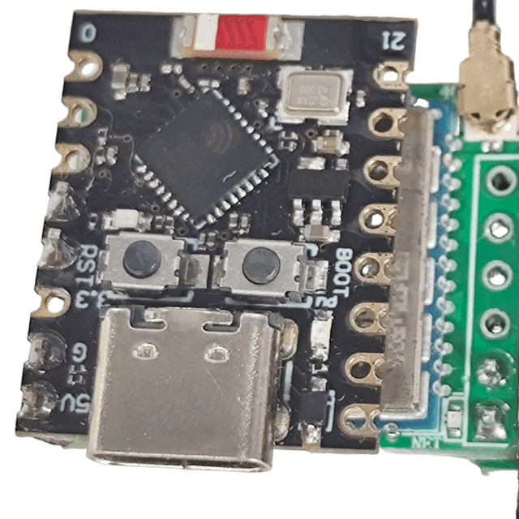
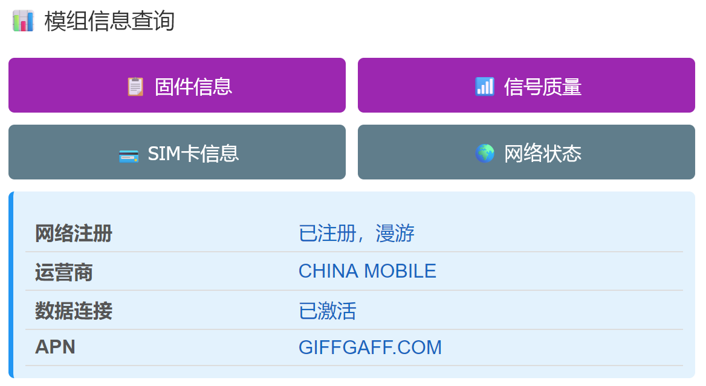
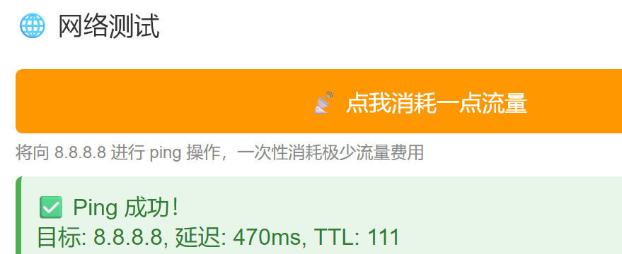

# 低成本短信转发器

> 作者:**Tianmoy** · 源码:<https://github.com/Tianmoy/sms_forwarding>

ESP32-C3 + ML307R 的短信接收与转发固件:全功能 Web 管理台、eSIM Profile 管理、多通道推送、定时任务,全部配置在网页完成,无需编译期凭据。

> 仓库起步于 [chenxuuu/sms_forwarding](https://github.com/chenxuuu/sms_forwarding),当前认证、eSIM、配置、推送与管理台均已整体重写。
> 仅用于接收短信与保号相关功能;不提供通话、拨号。

[后台页面演示](https://sms.j2.cx/) · [HTTP API 文档](API.md)



## 功能

### 短信
- 实时收件箱,最近 50 条持久化保存(LittleFS),满时自动淘汰最旧
- 每条标明发送方与接收卡;搜索、未读、详情、已读、单删、清空
- 长短信自动合并(30s 超时);黑名单过滤;管理员短信远程发短信/重启
- 网页端直接用设备卡发短信(号码白名单校验)
- 新短信通知(推送+邮件)在独立任务按队列顺序发送,不阻塞 Web 服务

### Web 管理台
- 深色响应式 SPA,桌面侧边栏 / 移动端底部导航自适应
- **Bearer Token 认证**:会话令牌(8h/30min 超时、绑定 IP)+ 长期 API 令牌双轨
- 登录失败渐进锁定(5 次起 30s,逐级翻倍至 15 分钟)
- 心跳卡实时显示手机号(CNUM)、运营商、信号;SIM 拔插/PIN/PUK 状态
- ETag 协商缓存 + 修订号增量轮询,二次访问几乎零流量
- 管理接口只返回脱敏配置,任何密钥/密码/令牌不回显明文

### eSIM / eUICC
- SGP.22 ES10c 读取 Profile 列表,二次确认后切换或删除
- EID 查询;非 eUICC 普通卡自动识别并优雅降级显示
- 通道两级降级(CCHO→CSIM 基础),兼容锁死 CCHO 的模组固件
- 切换为原子操作:断电重启模组→恢复配置→核对→自动选网,任务状态持久化

### 运营商与网络
- 异步扫描 PLMN、手动选网(仅限扫描白名单,带自动回退)、恢复自动
- WiFi 1 主 + 4 备,断线自动轮换;每网络稳定 IP 绑定
- 全部失败自动开热点 `sms-forwarder`(192.168.4.1)进首次配置向导

### 推送与任务
- **10 个推送通道**同时启用,每通道独立测试按钮:POST JSON / Bark / GET / 钉钉 / PushPlus / Server酱 / 自定义模板 / 飞书 / Gotify / Telegram
- 邮件通知(SMTP,独立配置与测试)
- 10 个定时任务:间隔/每天/每周/每月,支持设备重启、AT 命令、HTTP 请求(GET/POST + 自定义头/体,可用 API 令牌调本机接口)

## 快速开始

1. 按下方接线组装,USB 连接 ESP32-C3
2. 编译烧录(见下),设备先开热点 `sms-forwarder`
3. 连接热点访问 `http://192.168.4.1`,向导里配置 WiFi 与管理密码
4. 设备接入你的路由器后,用局域网 IP 访问管理台

> 初始账号 `admin` / `admin123`,首次登录后请立即修改。局域网 HTTP 请勿直接映射公网,远程访问应放在可信 VPN 之后。

## 编译烧录

所需库(Arduino Library Manager 安装):

- **ReadyMail** by Mobizt
- **pdulib** by David Henry

ESP32 开发板支持 ≥3.x,板型选 `MakerGO ESP32 C3 SuperMini`,**分区必须选 `no_ota`**(2MB 应用 + 2MB LittleFS,管理台超过默认应用分区)。

arduino-cli 示例:

```bash
arduino-cli compile --fqbn esp32:esp32:makergo_c3_supermini \
  --board-options PartitionScheme=no_ota code/

arduino-cli upload --fqbn esp32:esp32:makergo_c3_supermini \
  --board-options PartitionScheme=no_ota --port COM3 code/
```

页脚作者署名可通过 `AUTHOR_NAME` / `AUTHOR_URL` 编译宏覆盖。

## 硬件搭配

成品方案(无需焊接,支持**移动/联通/电信**卡):

- [小蓝鲸WIFI短信宝](https://item.taobao.com/item.htm?id=1003711355912)(找客服问)
- [4G FPC天线](https://item.taobao.com/item.htm?id=1003711355912&skuId=6162872574943),与开发板同购

自焊方案(总成本约 ¥27.8,仅支持**移动/联通**卡):

- ESP32C3 开发板,实测 [ESP32C3 Super Mini](https://item.taobao.com/item.htm?id=852057780489&skuId=5813710390565),¥9.5
- ML307R-DC 核心板,实测 [小蓝鲸ML307R-DC核心板](https://item.taobao.com/item.htm?id=797466121802&skuId=5722077108045),¥16.3
- [4G FPC天线](https://item.taobao.com/item.htm?id=797466121802&skuId=5722077108045),¥2

## 硬件连接

```
┌───────────────────────────────────────────────┐
|                                               |
|   ESP32C3 Super Mini      ML307R-DC核心板     |
| ┌───────────────────┐    ┌─────────────────┐ |
└─┼─ GPIO5 (MODEM_EN) │    │                 │ |
  │       GPIO3 (TX) ─┼───►│ RX              │ |
  │                   │    │             EN ─┼─┘
  │       GPIO4 (RX) ◄┼────┤ TX              │
  │                   │    │                 │
  │              GND ─┼────┤ GND             │
  │                   │    │                 │
  │               5V ─┼────┤ VCC (5V)        |
  │                   │    │                 │
  └───────────────────┘    └─────────────────┘
                           │  SIM卡槽 (Nano SIM)
                           │  天线接口 (4G天线)
                           └─────────────────┘
```

USB 连接 ESP32-C3 供电与烧录;运行期全部 AT 通信经网页进行。

## SIM 热插拔

固件用 `AT+CPIN?` 非阻塞轮询判断 SIM 状态,连续两次确认后更新。拔卡即撤销就绪并清空旧卡缓存。部分核心板不能在运行中可靠识别新卡——换卡后到"SIM / eSIM"页点**重新识别 SIM**(对模组重新上电,约 30–60s 恢复)。

## eSIM / eUICC 说明

仅适用于能返回标准 ISD-R Profile 列表的 eUICC 卡;普通 SIM 不会获得多 Profile 能力。后端只接受刚从卡内枚举的 Profile AID,不开放任意切卡 APDU;启用中的 Profile 不允许删除。切换期间短信与蜂窝中断 30–180 秒(漫游注册最长约 5 分钟),任务状态持久化并在重启后继续核对。

## 运营商选网说明

选网、APN、eSIM Profile 是三种独立功能。`AT+COPS=?` 扫描当前 Profile 可见 PLMN,只允许选择扫描结果中"可用"的数字 PLMN(带自动回退的manual 模式)。注意:`AT+CEREG?` 已注册不等于 MT 短信可达,驻留错误 PLMN 时可能收不到短信,排障记录见 [dev_doc/troubleshooting.md](dev_doc/troubleshooting.md)。

## 推送通道

| 推送方式 | 需要配置 |
|---------|---------|
| **POST JSON** | URL |
| **Bark** | Bark 服务器 URL |
| **GET请求** | URL |
| **钉钉机器人** | Webhook URL,可选 Secret 加签 |
| **PushPlus** | Token |
| **Server酱** | SendKey |
| **自定义模板** | URL + `{sender}` `{message}` `{timestamp}` 模板 |
| **飞书机器人** | Webhook URL |
| **Gotify** | 服务地址 + Token |
| **Telegram Bot** | Bot Token + Chat ID |

|状态信息|主动ping|
|-|-|
|||

## 许可

见 [LICENSE](LICENSE)。
